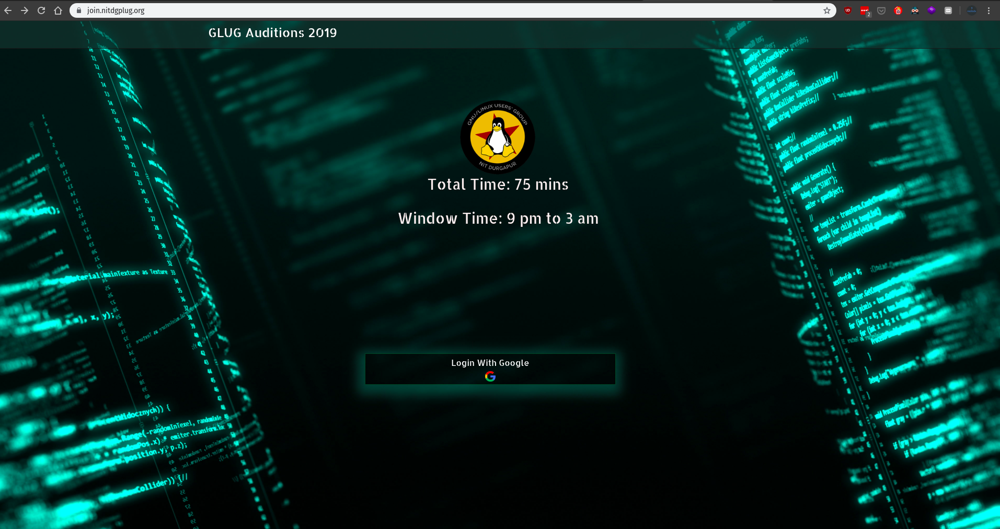

# OnlineTestSuite



Use a virtual envionment for installing this, 
i.e `venv` or `pipenv`.


For debian based distro, in virtual evironment terminal type
```shell
pip install -r requirements.txt
```
### To run the project on local machine
Create a PostgresSQL database.</br>
Then `cp .env.example .env` and change `.env` file according to your need.

Inside project directory type
```shell
python3 manage.py migrate
python3 manage.py collectstatic
python3 manage.py runserver
```